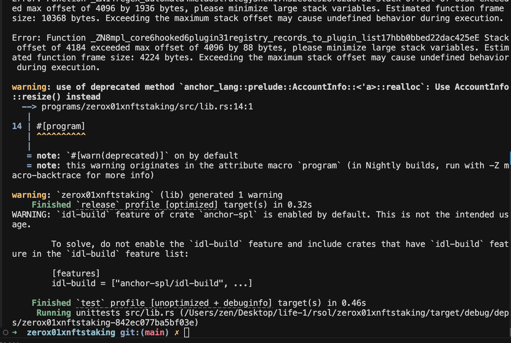

# zerox01xnftstaking

Metaplex Core NFT staking (Anchor).

## What it does

- **initialize** — create `StakeConfig` PDA + SPL reward vault (PDA token account)
- **stake / claim_rewards / unstake** — next: freeze NFT + track staking attributes + pay rewards

## Data model (current)

- **StakeConfig (PDA)** — one per collection
  - `authority` — signer that controls reward vault
  - `collection` — Metaplex Core collection pubkey
  - `reward_mint` — SPL token used for rewards
  - `reward_per_second` — emission rate

## Build

```bash
anchor build
```

## Test

```bash
anchor test
```

## Program ID (localnet)

```
8VattfYn7VfwWtiWuoVBmrFbGybcpG3G61VH7XG4Uo8d
```

### Screenshot



