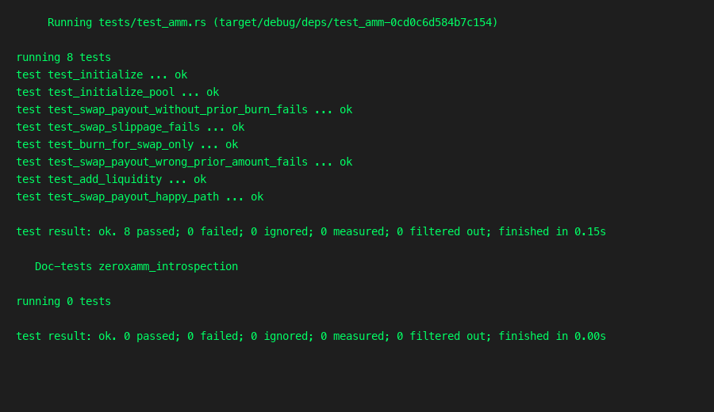

# zeroxamm-introspection

Constant-product AMM on Solana (Anchor **0.31.1**) demonstrating **instruction introspection** for Option 2 of the Week 6 assignment.

**Architecture (detailed):** [docs/ARCHITECTURE.md](docs/ARCHITECTURE.md) — account layout, PDAs, introspection flow, pricing, threat model, and diagrams.

## Assignment mapping

**Challenge:** Option 2 — AMM where swap input and output are **separate instructions**. `swap_payout` reads the Instructions sysvar and verifies the immediately preceding instruction was `burn_for_swap` with matching program ID, discriminator, args, and accounts before transferring output tokens.

**Why introspection:** Without it, a user could call `swap_payout` alone and drain pool vaults. Introspection ties payout to a provable input step in the **same atomic transaction**.

```text
Transaction:
  [0] (optional earlier ixs…)
  [N]   burn_for_swap   — user transfers input tokens into pool vault
  [N+1] swap_payout     — introspects ix N, then pays output from vault
```

## Instructions

| Instruction | Description |
|-------------|-------------|
| `initialize` | No-op entrypoint (smoke test) |
| `initialize_pool` | Create `PoolState` + token vault PDAs |
| `add_liquidity` | Deposit token A and B; update reserves |
| `burn_for_swap` | **Input step:** transfer `amount_in` from user ATA to pool vault |
| `swap_payout` | **Output step:** introspect prior `burn_for_swap`, constant-product math, pay user |

Swaps require **two instructions in one transaction** (burn then payout).

### `swap_payout` introspection checks

Using `load_current_index_checked` and `load_instruction_at_checked(current - 1)` on the Instructions sysvar:

1. Prior instruction `program_id` == this program
2. Anchor discriminator == `burn_for_swap`
3. Instruction data: `amount_in`, `is_a_to_b` match payout args
4. Account pubkeys at indices 0–6 match current context (user, pool, user ATAs, vaults, token program)

## Math

```text
amount_out = (amount_in * reserve_out) / (reserve_in + amount_in)
```

Example: 100 A into a 1000/1000 pool → 90 B out.

## Build

```bash
anchor build
```

Requires SPL Token `.so` for tests (reuses fixture from `zeroxnft-staking/tests/fixtures/spl_token.so`).

## Test

```bash
bash scripts/test.sh
# or
anchor build && cargo test
```

LiteSVM integration tests (no local validator):

| Test | Covers |
|------|--------|
| `test_initialize` | `initialize` |
| `test_initialize_pool` | pool + vault PDAs |
| `test_add_liquidity` | reserves + vault balances |
| `test_burn_for_swap_only` | input transfer alone |
| `test_swap_payout_happy_path` | two-ix swap (100 A → 90 B) |
| `test_swap_payout_without_prior_burn_fails` | payout-only tx fails |
| `test_swap_payout_wrong_prior_amount_fails` | mismatched `amount_in` fails |
| `test_swap_slippage_fails` | `min_amount_out` too high fails |

### Screenshot



## Program ID

```
7xKp2mNqR8vYw3tZfHjL9sDc4eUb6aFg1nXi5oPr7QwE
```
