# Architecture from first principles

How **zeroxamm-introspection** works: built from the ground up with diagrams and explicit **state transitions** before and after each instruction.

---

## Part 1 — Foundations

### 1.1 Transactions and atomicity

A **transaction** is an ordered list of instructions. Solana runs them in sequence. If any instruction fails, **none** of the changes from that transaction are kept.

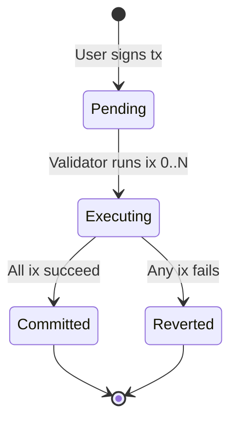

**First principle:** A swap split across two instructions is still **one atomic unit**. Either both `burn_for_swap` and `swap_payout` succeed, or the ledger looks as if neither ran.

### 1.2 Programs, accounts, and tokens

| Concept | Role |
|---------|------|
| **Program** | Stateless code (this AMM) |
| **Account** | Persistent bytes + owner + lamports |
| **SPL Token account** | Holds a balance of one mint |
| **Mint** | Token type (e.g. USDC, custom A) |

Programs never “store coins inside themselves.” They update **token accounts** by calling the SPL Token program (CPI transfer).

### 1.3 What an AMM is

Two token types **A** and **B** sit in a pool. Reserves `(Ra, Rb)` define the price. Traders add A and receive B (or the reverse).

**Constant product** (no fee in this demo):

```text
amount_out = (amount_in × R_out) / (R_in + amount_in)
```

Example: `Ra = Rb = 1000`, swap in `100` A → out `90` B.

---

## Part 2 — System diagram

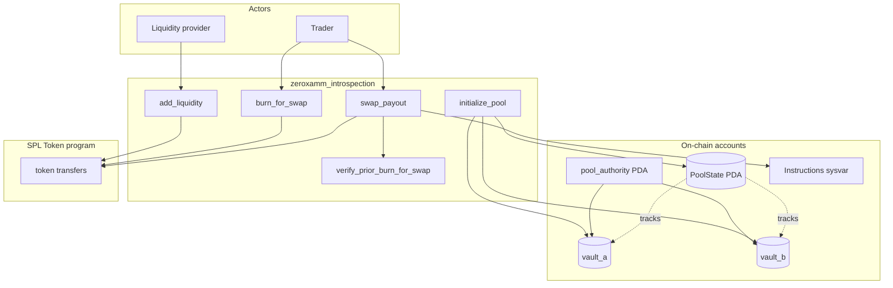

---

## Part 3 — Account layout (PDAs)

```text
pool_state     = PDA["pool", mint_a, mint_b, pool_id]
pool_authority = PDA["authority", pool_state]   ← owns vaults
vault_a        = PDA["vault_a", pool_state]
vault_b        = PDA["vault_b", pool_state]
```

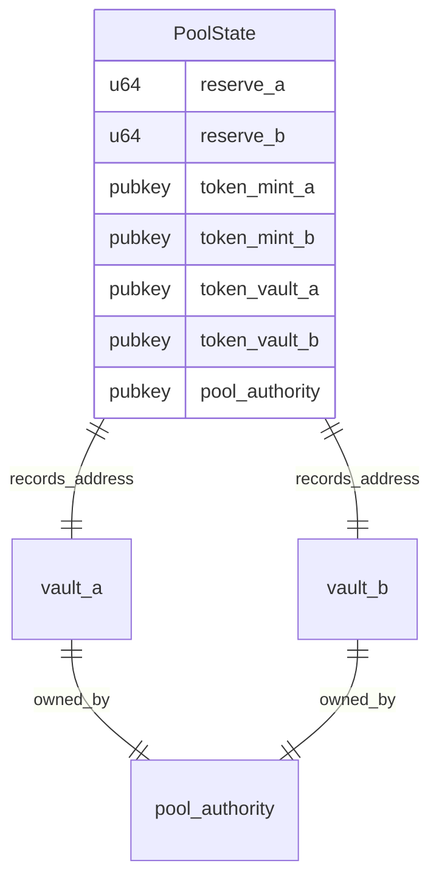

**Two layers of “how much is in the pool”:**

| Layer | Where | Used for |
|-------|--------|----------|
| **Reserves** | `PoolState.reserve_a/b` | Pricing (`get_amount_out`) |
| **Vault balances** | SPL token account `amount` | Actual tokens |

They should match after correct use of `add_liquidity` and a full two-step swap.

---

## Part 4 — Global state machine (pool lifecycle)

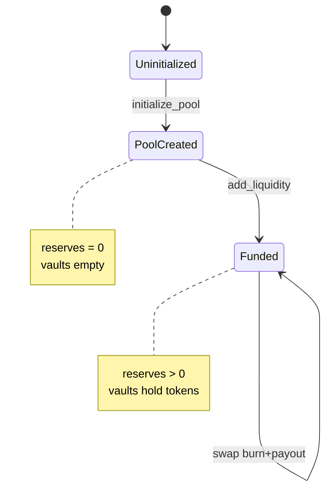

---

## Part 5 — State transitions per instruction

Notation:

- `UA`, `UB` = user token A/B balances  
- `VA`, `VB` = vault A/B balances  
- `Ra`, `Rb` = reserves in `PoolState`  

### 5.1 `initialize_pool`

**Pre:** Pool PDA does not exist.

**Post:**

| Variable | Value |
|----------|--------|
| `Ra`, `Rb` | `0` |
| `VA`, `VB` | `0` |
| Pool + vaults + authority | Created |

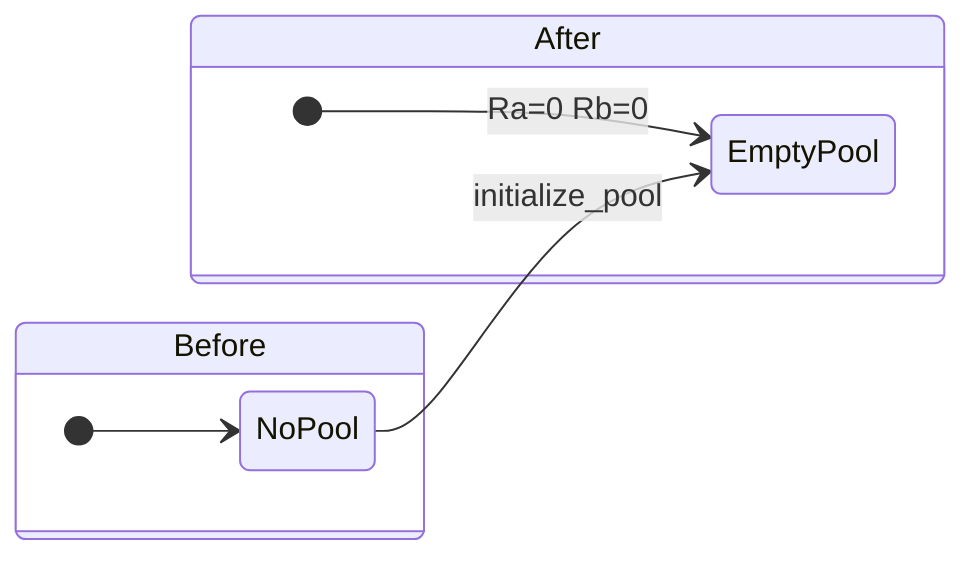

---

### 5.2 `add_liquidity(amount_a, amount_b)`

**Pre:** Pool exists; user has ≥ `amount_a` A and ≥ `amount_b` B.

**Transition** (example: deposit `1000` A, `1000` B):

| | Before | After |
|---|--------|-------|
| `UA` | `10000` | `9000` |
| `UB` | `10000` | `9000` |
| `VA` | `0` | `1000` |
| `VB` | `0` | `1000` |
| `Ra` | `0` | `1000` |
| `Rb` | `0` | `1000` |

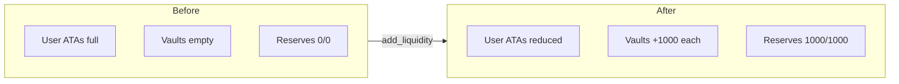

**First principle:** Liquidity updates **both** vaults and reserves in one instruction.

---

### 5.3 `burn_for_swap(amount_in, is_a_to_b)` — swap leg 1

**Pre (A→B example):** `is_a_to_b = true`, pool funded, `UA ≥ amount_in`.

**Transition** (`amount_in = 100`):

| | Before | After |
|---|--------|-------|
| `UA` | `10000` | `9900` |
| `VA` | `1000` | `1100` |
| `Ra`, `Rb` | `1000`, `1000` | **unchanged** |
| `UB`, `VB` | unchanged | unchanged |

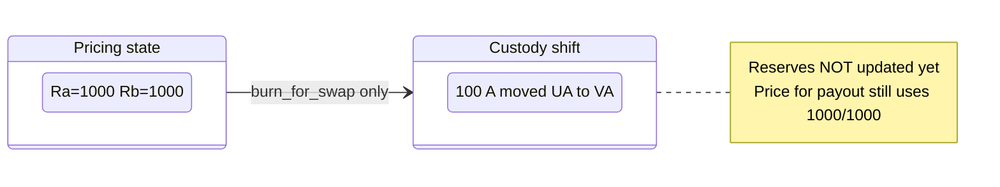

**First principle:** Leg 1 moves tokens only. Reserves update on leg 2 so the formula still sees pre-trade reserves.

---

### 5.4 `swap_payout(amount_in, min_out, is_a_to_b)` — swap leg 2

**Pre:**

1. Same transaction already ran `burn_for_swap` with **same** `amount_in`, `is_a_to_b`, and accounts (enforced by introspection).
2. Leg 1 succeeded (vault has input tokens).

**Introspection** (before any transfer out):

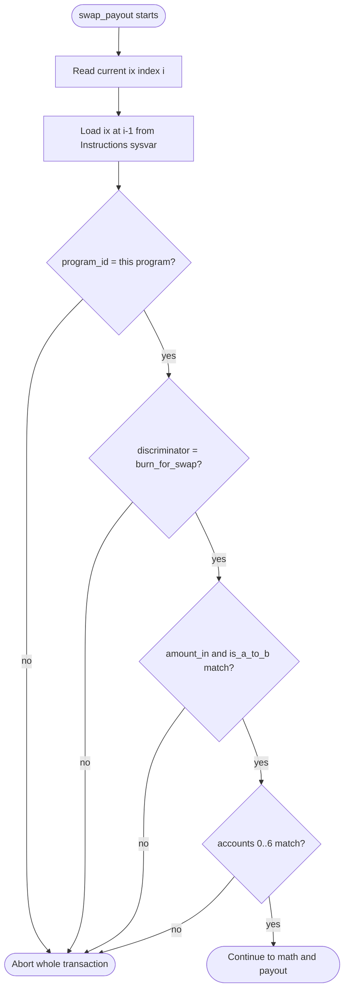

**Math:** `out = (100 × 1000) / (1000 + 100) = 90`

**Transition** (continuing A→B, `min_out = 90`):

| | After burn only | After payout |
|---|-----------------|--------------|
| `UA` | `9900` | `9900` |
| `UB` | `10000` | `10090` |
| `VA` | `1100` | `1100` |
| `VB` | `1000` | `910` |
| `Ra` | `1000` | `1100` |
| `Rb` | `1000` | `910` |

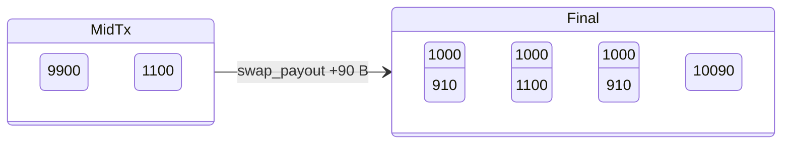

---

## Part 6 — Full swap as one transaction

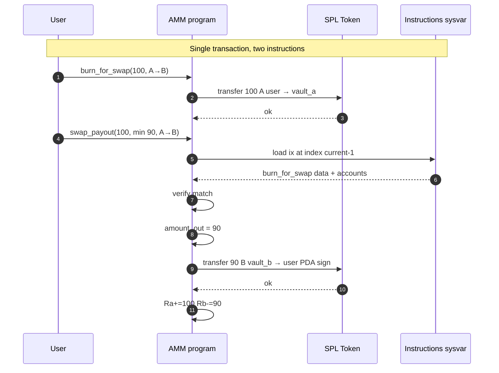

### Transaction index timeline

```text
Index │ Instruction        │ PoolState      │ Vault A │ Vault B │ User A │ User B
──────┼────────────────────┼────────────────┼─────────┼─────────┼────────┼────────
  0   │ (optional others)  │ 1000/1000      │ 1000    │ 1000    │ 10000  │ 10000
  1   │ burn_for_swap      │ 1000/1000      │ 1100    │ 1000    │ 9900   │ 10000
  2   │ swap_payout        │ 1100/910       │ 1100    │ 910     │ 9900   │ 10090
```

---

## Part 7 — Why introspection exists (first principles)

**Problem:** `swap_payout` can sign transfers **out** of vaults. Without a guard, a transaction with **only** payout could drain the pool.

**Wrong fixes:**

| Idea | Why it fails |
|------|----------------|
| “Check vault balance increased” | Ambiguous mid-transaction; other ixs in same tx can interfere |
| “CPI to burn instruction” | You need proof the **real** burn ix ran in **this** tx |

**Correct fix:** Read the **Instructions sysvar** — the runtime’s copy of every instruction in the current transaction. Confirm instruction `i-1` is exactly your `burn_for_swap` with matching args and accounts.

Same pattern as **Ed25519 verify → ResolveBet** in the course: instruction `N` establishes a fact; instruction `N+1` **observes** it.

---

## Part 8 — Failure state transitions

All failures **revert the entire transaction** (including leg 1).

| Scenario | Fails at | State on chain |
|----------|----------|----------------|
| Only `swap_payout` | Introspection: no prior ix | Unchanged |
| Payout `amount_in=50`, burn `100` | `PriorInstructionDataMismatch` | Unchanged |
| `min_out` too high | `SlippageExceeded` | Unchanged |
| Wrong vault in burn | Account mismatch on payout | Unchanged |

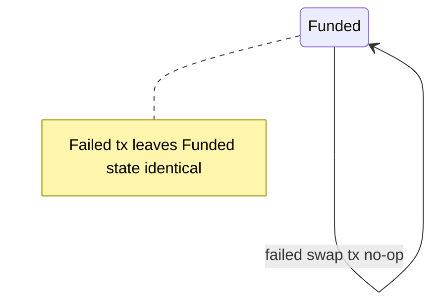

---

## Part 9 — Instruction account lists (for introspection)

`burn_for_swap` account order (indices 0–6) must match what `swap_payout` expects on the prior ix:

| Index | Account |
|-------|---------|
| 0 | `user` (signer) |
| 1 | `pool_state` |
| 2 | `user_token_a` |
| 3 | `user_token_b` |
| 4 | `vault_a` |
| 5 | `vault_b` |
| 6 | `token_program` |

`swap_payout` adds:

| Index | Account |
|-------|---------|
| 7 | `pool_authority` |
| 8 | `instruction_sysvar` (read-only) |

Prior ix **data** layout:

```text
[0..8)   Anchor discriminator for burn_for_swap
[8..16)  amount_in (u64 LE)
[16]     is_a_to_b (0 or 1)
```

---

## Part 10 — Code map

| Topic | File |
|-------|------|
| Entrypoints | `programs/.../src/lib.rs` |
| `PoolState` | `src/state.rs` |
| Introspection | `src/utils/introspection.rs` |
| Leg 1 | `src/instructions/burn_for_swap.rs` |
| Leg 2 + math | `src/instructions/swap_payout.rs` |
| Tests | `tests/test_amm.rs` |

---

## Part 11 — Client checklist

1. Call `initialize_pool` then `add_liquidity` (separate transactions are fine).
2. For each swap, **one transaction**, **two instructions**, in order:
   - `burn_for_swap`
   - `swap_payout` (include Instructions sysvar account)
3. Use the **same** `amount_in` and `is_a_to_b` in both.
4. Set `min_amount_out` from off-chain quote of `get_amount_out`.

---

## Related

- [README](../README.md) — build and test  
- [Solana instruction introspection](https://docs.solanalabs.com/implemented-prototypes/instruction_introspection)
