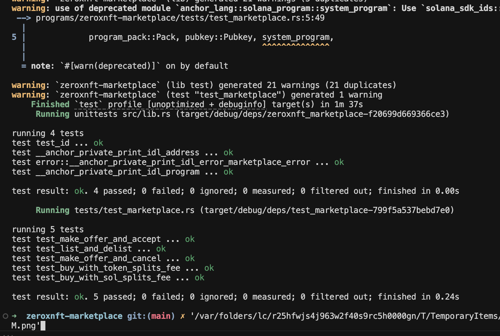

# zeroxnft-marketplace

Metaplex Core NFT Marketplace (Assignment 2): **list/delist**, **buy with SOL**, **buy with SPL tokens**, and **make/accept/cancel offers** with SOL escrow.

## Instructions

- **`initialize_marketplace(fee_bps)`**: creates a `MarketplaceConfig` PDA.
- **`list(price, payment_mint)`**: creates a `Listing` PDA and adds a Core **TransferDelegate** plugin so the listing PDA can transfer on sale.
- **`delist()`**: removes the TransferDelegate plugin and closes the listing.
- **`buy()`**: SOL purchase; splits maker/treasury by `fee_bps`, transfers the asset, closes the listing.
- **`buy_with_token()`**: SPL-token purchase; splits via `token_interface::transfer_checked`, transfers the asset, closes the listing.
- **`make_offer(amount)`**: creates an `Offer` PDA and escrows SOL into it.
- **`accept_offer()`**: asset owner accepts; transfers asset, pays out escrow to maker+treasury, closes the offer.
- **`cancel_offer()`**: buyer cancels; refunds escrow and closes the offer.

## Accounts

- **`MarketplaceConfig`** (PDA): `[b"marketplace", authority]`
- **`Listing`** (PDA): `[b"listing", asset]`
- **`Offer`** (PDA): `[b"offer", asset, buyer]` (stores state + holds escrowed lamports)

## Build + test (LiteSVM)

From `zeroxnft-marketplace/`:

```bash
bash scripts/test.sh
```

## Passing tests screenshot



